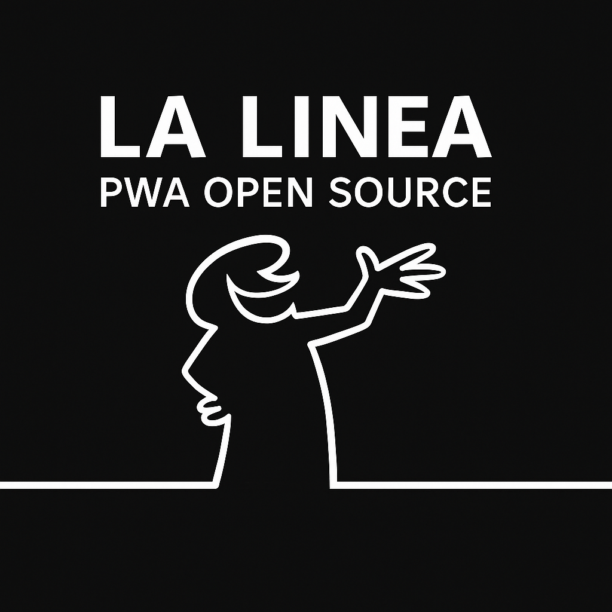

# 🎬 La Linea — Gioco Tributo (B/N)

Omaggio stilistico all’idea di **Osvaldo Cavandoli**.  
Un fan-game didattico, gratuito e open source, sviluppato come **Progressive Web App** (PWA).

👉 [Gioca subito](https://www.alessandropezzali.it/Linea_sperimentale/)

---

### ✨ Caratteristiche

- Stile minimalista in bianco/nero  
- Personaggio animato (bocca, braccia)  
- Bonus in aria, ponti disegnati dalla mano, fiumi, piante, lupi  
- 3 vite, livelli progressivi e difficoltà crescente  
- Input da tastiera, touch e pulsanti mobili  
- Installabile offline

---

### 🎮 Comandi di gioco

**Laptop / PC (tastiera):**  
- `←` / `→` → muovi a sinistra / destra  
- `Space` → salta  
- `↓` → fermati  
- `P` → pausa / riprendi  
- `R` → restart

**Smartphone / Tablet (touch / pulsanti virtuali):**  
- Tocca il canvas o il pulsante “SALTA” per saltare  
- Usa i pulsanti **←** e **→** sullo schermo per muoverti  
- In modalità mobile, i pulsanti virtuali appaiono automaticamente  
- Su dispositivi touch la scritta “spazio” è solo come suggerimento (classe `.kbd` nascosta)

---

© 2025 — [pezzaliAPP](https://www.alessandropezzali.it) — MIT License
